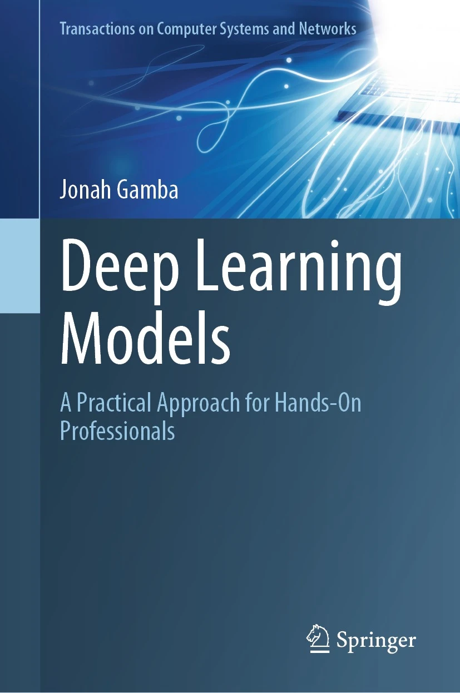

# Springer Nature Code Inside

This Repository accompanies the book [*Deep Learning Models: A Practical Approach for Hands-On Professionals*](https://doi.org/10.1007/978-981-99-9672-8) by Jonah Gamba (Springer Singapore, 2024).

